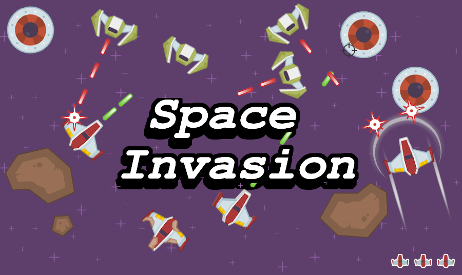

# Space Invasion
<p align="center">
  <a href="https://github.com/keszinaj/Space-Invasion">
    
  </a>
</p>

## About The Project
Space Invaasion is a simple open source shooter game. It's my first program written in Python.
## Installation
0. Install pygame 
```sh
   pip install pygame
   ````
1. Clone the repo
   ```sh
   git clone https://github.com/keszinaj/Space-Invasion.git
   ```
2.Go to file
  ```sh
  cd Space-Invasion/src
  ```
3. Play
  ```sh
  python3 main.py
  ```
 ## Acknowledgements

* [dklon] (https://opengameart.org/users/dklon)

